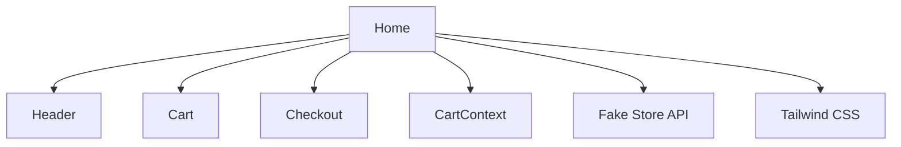

# 🛒 GilStore

## 🌐 Site publicado

[Acesse a loja online](https://marciogil.github.io/GilStore/)


## 🎯 Funcionalidades

## 🏗️ Arquitetura




- **src/pages/Home.tsx**: Catálogo, filtros, lógica principal

- **src/components/Header.tsx**: Cabeçalho e nome da loja

- **src/components/Cart.tsx**: Modal do carrinho

- **src/services/api.ts**: Integração com Fake Store API


## 📚 Sumário

## 🧑‍💻 Exemplo de uso

1. Abra o site e navegue pelos produtos.

2. Clique em um produto para abrir o modal de detalhes.

3. Feche o modal com Esc, clicando fora ou no X.

4. Adicione produtos ao carrinho.

5. Finalize a compra e veja o estoque ser atualizado em tempo real.

6. Confira o estoque na tela do produto ou via API (`/products`).

**Como resetar o estoque?**

Edite o arquivo `db.json` e reinicie o mock backend (`npm run server`).

**Funciona offline?**

Sim, o site é PWA e pode ser instalado. O backend mock precisa estar rodando para atualizar o estoque.

**Como rodar o backend mock?**

Use `npm run server` em outro terminal.

## 🗺️ Roadmap

- [ ] Exibir histórico de compras detalhado

- [ ] Melhorar responsividade mobile

- [ ] Adicionar autenticação de usuário

- [ ] Integração com API real

- [ ] Melhorias de acessibilidade contínuas

- [ ] Testes automatizados de acessibilidade

## ♿ Acessibilidade e Tecnologias Utilizadas

### Modal de Produto: Acessibilidade e Navegação

- O modal de detalhes do produto é centralizado e acessível.

- Pode ser fechado de três formas:

   - Clicando no botão "X" (Fechar)

   - Pressionando a tecla **Esc**

   - Clicando fora do modal (na área escura)

- O foco é mantido no modal enquanto ele está aberto.

- O modal possui `aria-modal="true"` e `role="dialog"` para leitores de tela.


### Como usar o site de forma acessível

- **Abrir detalhes de um produto:**

   - Clique ou navegue com Tab/Enter até o card do produto e pressione Enter.

- **Fechar o modal de produto:**

   - Pressione **Esc**, clique fora do modal ou clique no botão "X".

- **Navegação por teclado:**

   - Use Tab para navegar entre botões, cards e campos de formulário.

   - Use Enter/Espaço para ativar botões e abrir modais.

- **Adicionar ao carrinho:**

   - Use o botão "Adicionar ao carrinho" no card ou no modal do produto.

- **Acessar carrinho, favoritos e histórico:**

   - Use os botões no topo da página (acessíveis por Tab e com ARIA).

- **Checkout:**

   - Todos os campos do checkout possuem labels e podem ser preenchidos por teclado.

### 🚀 Tecnologias principais

- React 19 (TypeScript)

- Tailwind CSS 3

- json-server (mock backend REST)

- ESLint, Prettier, Husky, lint-staged

- Jest, React Testing Library

- GitHub Actions CI

- PWA (service worker, manifest)

## 🚀 Deploy

O deploy é feito via GitHub Pages. Após testar localmente, siga as instruções abaixo.

## 🌐 Como Fazer o Deploy no GitHub Pages

1. Configure o campo `homepage` no `package.json`:

   ```json

   "homepage": "https://MarcioGil.github.io/GilStore"

   ```

2. Instale o pacote gh-pages:

   ```bash

   npm install --save gh-pages

   ```

3. Adicione os scripts ao `package.json`:

   ```json

   "scripts": {

   "predeploy": "npm run build",

   "deploy": "gh-pages -d build"

   }

   ```

4. Execute o deploy:

   ```bash

   npm run deploy

   ```

5. O site estará disponível em: [https://MarcioGil.github.io/GilStore](https://MarcioGil.github.io/GilStore)

## 🤝 Como Contribuir

1. Faça um fork do projeto

2. Crie uma branch: `git checkout -b minha-feature`

3. Faça suas alterações

4. Envie um pull request

### Regras para Colaboradores

- Siga o padrão de código do projeto

- Escreva comentários claros

- Teste antes de enviar PR

- Respeite a licença e o código de conduta

## 📄 Licença

Este projeto está sob a licença MIT. Veja o arquivo [LICENSE](LICENSE) para mais detalhes.

## 👤 Apresentação

Olá! Eu sou **Márcio Gil**, Embaixador da turma 14 do DIO Campus Expert, Estudante do 5° período de Engenharia de Software, entusiasta da Educação, Inovação, Tecnologia e numa constante luta por Justiça Social.

- [LinkedIn](https://linkedin.com/in/márcio-gil-1b7669309)

- [Currículo](https://marciogil.github.io/curriculum-vitae/)

- [GitHub Pessoal](https://github.com/MarcioGil/MarcioGil.git)

## 📫 Contato

Fique à vontade para entrar em contato e contribuir!

---

> Projeto desenvolvido para portfólio, estudos e colaboração aberta.

## ⚡ PWA: Progressive Web App

- **Instalável**: Pode ser adicionada à tela inicial do celular ou desktop, funcionando como um app nativo.

- **Offline**: Funciona sem conexão após o primeiro acesso, graças ao service worker e cache inteligente.

- **Performance**: Carregamento rápido, otimização de bundle e recursos, experiência fluida mesmo em redes lentas.

- **Manifesto customizado**: Ícones, nome, tema e descrição próprios da GilStore.

- **Prompt de instalação**: Usuário recebe sugestão para instalar no dispositivo.


> Teste: Acesse pelo Chrome/Edge no celular ou desktop, clique em "Instalar GilStore" na barra de endereço ou menu do navegador.

# 🛒 GilStore
## 🌐 Site publicado
[Acesse a loja online](https://marciogil.github.io/GilStore/)

## 🎯 Funcionalidades
## 🏗️ Arquitetura
```mermaid
graph TD;
   Home[Home]
   Header[Header]
   Cart[Cart]
   Checkout[Checkout]
   CartContext[CartContext]
   API[Fake Store API]
   Tailwind[Tailwind CSS]
   Home --> Header
   Home --> Cart
   Home --> Checkout
   Home --> CartContext
   Home --> API
   Home --> Tailwind
- **src/pages/Home.tsx**: Catálogo, filtros, lógica principal
- **src/components/Header.tsx**: Cabeçalho e nome da loja
- **src/components/Cart.tsx**: Modal do carrinho
- **src/services/api.ts**: Integração com Fake Store API
## 📚 Sumário
## 🧑‍💻 Exemplo de uso
1. Abra o site e navegue pelos produtos.
2. Clique em um produto para abrir o modal de detalhes.
3. Feche o modal com Esc, clicando fora ou no X.
4. Adicione produtos ao carrinho.
5. Finalize a compra e veja o estoque ser atualizado em tempo real.
6. Confira o estoque na tela do produto ou via API (`/products`).
**Como resetar o estoque?**
Edite o arquivo `db.json` e reinicie o mock backend (`npm run server`).
**Funciona offline?**
Sim, o site é PWA e pode ser instalado. O backend mock precisa estar rodando para atualizar o estoque.
**Como rodar o backend mock?**
Use `npm run server` em outro terminal.
## 🗺️ Roadmap
- [ ] Exibir histórico de compras detalhado
- [ ] Melhorar responsividade mobile
- [ ] Adicionar autenticação de usuário
- [ ] Integração com API real
- [ ] Melhorias de acessibilidade contínuas
- [ ] Testes automatizados de acessibilidade
## ♿ Acessibilidade e Tecnologias Utilizadas
### Modal de Produto: Acessibilidade e Navegação
- O modal de detalhes do produto é centralizado e acessível.
- Pode ser fechado de três formas:
   - Clicando no botão "X" (Fechar)
   - Pressionando a tecla **Esc**
   - Clicando fora do modal (na área escura)
- O foco é mantido no modal enquanto ele está aberto.
- O modal possui `aria-modal="true"` e `role="dialog"` para leitores de tela.
### Como usar o site de forma acessível
- **Abrir detalhes de um produto:**
   - Clique ou navegue com Tab/Enter até o card do produto e pressione Enter.
- **Fechar o modal de produto:**
   - Pressione **Esc**, clique fora do modal ou clique no botão "X".
- **Navegação por teclado:**
   - Use Tab para navegar entre botões, cards e campos de formulário.
   - Use Enter/Espaço para ativar botões e abrir modais.
- **Adicionar ao carrinho:**
   - Use o botão "Adicionar ao carrinho" no card ou no modal do produto.
- **Acessar carrinho, favoritos e histórico:**
   - Use os botões no topo da página (acessíveis por Tab e com ARIA).
- **Checkout:**
   - Todos os campos do checkout possuem labels e podem ser preenchidos por teclado.
### 🚀 Tecnologias principais
- React 19 (TypeScript)
- Tailwind CSS 3
- json-server (mock backend REST)
- ESLint, Prettier, Husky, lint-staged
- Jest, React Testing Library
- GitHub Actions CI
- PWA (service worker, manifest)
## 🚀 Deploy
O deploy é feito via GitHub Pages. Após testar localmente, siga as instruções abaixo.
## 🌐 Como Fazer o Deploy no GitHub Pages
1. Configure o campo `homepage` no `package.json`:
   ```json
   "homepage": "https://MarcioGil.github.io/GilStore"
   ```
2. Instale o pacote gh-pages:
   ```bash
   npm install --save gh-pages
   ```
3. Adicione os scripts ao `package.json`:
   ```json
   "scripts": {
   "predeploy": "npm run build",
   "deploy": "gh-pages -d build"
   }
   ```
4. Execute o deploy:
   ```bash
   npm run deploy
   ```
5. O site estará disponível em: [https://MarcioGil.github.io/GilStore](https://MarcioGil.github.io/GilStore)
## 🤝 Como Contribuir
1. Faça um fork do projeto
2. Crie uma branch: `git checkout -b minha-feature`
3. Faça suas alterações
4. Envie um pull request
### Regras para Colaboradores
- Siga o padrão de código do projeto
- Escreva comentários claros
- Teste antes de enviar PR
- Respeite a licença e o código de conduta
## 📄 Licença
Este projeto está sob a licença MIT. Veja o arquivo [LICENSE](LICENSE) para mais detalhes.
## 👤 Apresentação
Olá! Eu sou **Márcio Gil**, Embaixador da turma 14 do DIO Campus Expert, Estudante do 5° período de Engenharia de Software, entusiasta da Educação, Inovação, Tecnologia e numa constante luta por Justiça Social.
- [LinkedIn](https://linkedin.com/in/márcio-gil-1b7669309)
- [Currículo](https://marciogil.github.io/curriculum-vitae/)
- [GitHub Pessoal](https://github.com/MarcioGil/MarcioGil.git)
## 📫 Contato
Fique à vontade para entrar em contato e contribuir!
---
> Projeto desenvolvido para portfólio, estudos e colaboração aberta.
## ⚡ PWA: Progressive Web App
- **Instalável**: Pode ser adicionada à tela inicial do celular ou desktop, funcionando como um app nativo.
- **Offline**: Funciona sem conexão após o primeiro acesso, graças ao service worker e cache inteligente.
- **Performance**: Carregamento rápido, otimização de bundle e recursos, experiência fluida mesmo em redes lentas.
- **Manifesto customizado**: Ícones, nome, tema e descrição próprios da GilStore.
- **Prompt de instalação**: Usuário recebe sugestão para instalar no dispositivo.
> Teste: Acesse pelo Chrome/Edge no celular ou desktop, clique em "Instalar GilStore" na barra de endereço ou menu do navegador.
# GilStore

## 🌐 Site publicado
[Acesse a loja online](https://marciogil.github.io/GilStore/)


## ♿ Acessibilidade e Tecnologias Utilizadas

Este projeto foi desenvolvido com foco em acessibilidade e experiência do usuário, utilizando:

- **React**: Componentização, semântica (header, main, button, form), navegação por teclado e foco gerenciado.
- **Tailwind CSS**: Contraste, responsividade, foco visível (`focus:outline`, `focus:ring`), classes utilitárias para acessibilidade visual.
- **Aria-labels, role e tabIndex**: Elementos interativos possuem atributos ARIA (`aria-label`, `role`, `tabIndex`) para leitores de tela e navegação assistida.
- **Labels em formulários**: Todos os campos possuem labels associadas para melhor compreensão e navegação por leitores de tela.
- **Mensagens de erro e feedbacks visuais**: Informações claras e acessíveis para todos os usuários, inclusive em estados de erro ou carregamento.
- **Testes manuais**: O site foi testado com navegação por teclado (Tab, Enter, Esc), leitores de tela e navegação por mouse.
- **PWA**: Funciona offline, pode ser instalado como app, com manifesto customizado.

### Modal de Produto: Acessibilidade e Navegação

- O modal de detalhes do produto é centralizado e acessível.
- Pode ser fechado de três formas:
   - Clicando no botão "X" (Fechar)
   - Pressionando a tecla **Esc**
   - Clicando fora do modal (na área escura)
- O foco é mantido no modal enquanto ele está aberto.
- O modal possui `aria-modal="true"` e `role="dialog"` para leitores de tela.

### Como usar o site de forma acessível

- **Abrir detalhes de um produto:**
   - Clique ou navegue com Tab/Enter até o card do produto e pressione Enter.
- **Fechar o modal de produto:**
   - Pressione **Esc**, clique fora do modal ou clique no botão "X".
- **Navegação por teclado:**
   - Use Tab para navegar entre botões, cards e campos de formulário.
   - Use Enter/Espaço para ativar botões e abrir modais.
- **Adicionar ao carrinho:**
   - Use o botão "Adicionar ao carrinho" no card ou no modal do produto.
- **Acessar carrinho, favoritos e histórico:**
   - Use os botões no topo da página (acessíveis por Tab e com ARIA).
- **Checkout:**
   - Todos os campos do checkout possuem labels e podem ser preenchidos por teclado.

### Tecnologias principais

- React 19 (TypeScript)
- Tailwind CSS 3
- json-server (mock backend REST)
- ESLint, Prettier, Husky, lint-staged
- Jest, React Testing Library
2. Inicie o mock backend em outra aba/terminal:

    ```bash
    npm run server
    ```
[GitHub: MarcioGil/GilStore](https://github.com/MarcioGil/GilStore)


<p align="center">
  
</p>

# 🛒 GilStore

Loja virtual desenvolvida em React + Tailwind CSS, com catálogo dinâmico da Fake Store API, carrinho, filtros avançados, checkout e acessibilidade. O projeto é responsivo, acessível para PCDs e pronto para deploy no GitHub Pages.
## 🎯 Funcionalidades

- Catálogo de produtos dinâmico
- Filtros avançados (nome, categoria, preço, avaliação, ordenação)
- Carrinho de compras com edição
- Checkout com resumo
- Tradução de nomes e categorias para português
- Layout responsivo e acessível
- Deploy fácil no GitHub Pages

## 🏗️ Arquitetura

```mermaid
graph TD;
  Home[Home]
  Header[Header]
  Cart[Cart]
  Checkout[Checkout]
  CartContext[CartContext]
  API[Fake Store API]
  Tailwind[Tailwind CSS]
  Home --> Header
  Home --> Cart
# GilStore

## 📚 Sumário

- [Demonstração](#-demonstração)
- [Funcionalidades](#-funcionalidades)
- [Acessibilidade](#-acessibilidade-e-tecnologias-utilizadas)
- [Como rodar localmente](#-como-executar-localmente)
- [Mock Backend](#-mock-backend-controle-de-estoque-realista)
- [Exemplo de uso](#-exemplo-de-uso)
- [FAQ](#-faq)
- [Roadmap](#-roadmap)
- [Deploy](#-como-fazer-o-deploy-no-github-pages)
- [Contribuindo](#-como-contribuir)
## 🧑‍💻 Exemplo de uso

1. Abra o site e navegue pelos produtos.
2. Clique em um produto para abrir o modal de detalhes.
3. Feche o modal com Esc, clicando fora ou no X.
4. Adicione produtos ao carrinho.
5. Finalize a compra e veja o estoque ser atualizado em tempo real.
6. Confira o estoque na tela do produto ou via API (`/products`).

**Como resetar o estoque?**

Edite o arquivo `db.json` e reinicie o mock backend (`npm run server`).

**Funciona offline?**
Sim, o site é PWA e pode ser instalado. O backend mock precisa estar rodando para atualizar o estoque.

**Como rodar o backend mock?**

Use `npm run server` em outro terminal.
---
## 🗺️ Roadmap

- [ ] Exibir histórico de compras detalhado
- [ ] Melhorar responsividade mobile
- [ ] Adicionar autenticação de usuário
- [ ] Integração com API real
- [ ] Melhorias de acessibilidade contínuas
- [ ] Testes automatizados de acessibilidade

---
  Home --> API
  Home --> Tailwind
- **src/pages/Home.tsx**: Catálogo, filtros, lógica principal
- **src/components/Header.tsx**: Cabeçalho e nome da loja
- **src/components/Cart.tsx**: Modal do carrinho
- **src/services/api.ts**: Integração com Fake Store API


## 🚀 Deploy
O deploy é feito via GitHub Pages. Após testar localmente, siga as instruções abaixo.


---

## 🗄️ Mock Backend (Controle de Estoque Realista)

Para simular um backend realista com controle de estoque, utilize o **json-server** já configurado neste projeto.

### Como rodar o mock server

1. Instale as dependências (se ainda não fez):

   ```bash
   npm install
   ```
2. Inicie o mock backend em outra aba/terminal:

   ```bash
   npm run server
   ```
   Isso irá rodar o json-server em [http://localhost:3001/products](http://localhost:3001/products)

### Como funciona o controle de estoque?

- O frontend consome a API local do mock backend (`db.json`).
- Ao finalizar uma compra, o estoque de cada produto é decrementado automaticamente via API.
- Se o estoque chegar a 0, o produto ficará indisponível para novas compras.
- Você pode editar o arquivo `db.json` para resetar ou ajustar estoques manualmente.

### Testando a integração

1. Inicie o frontend normalmente (`npm start`).
2. Inicie o mock backend (`npm run server`).
3. Adicione produtos ao carrinho e finalize a compra.
4. O estoque será atualizado em tempo real no backend mock.
5. Para ver o estoque atualizado, recarregue a página ou consulte [http://localhost:3001/products](http://localhost:3001/products).

---

## 🌐 Como Fazer o Deploy no GitHub Pages

1. Configure o campo `homepage` no `package.json`:

   ```json
   "homepage": "https://MarcioGil.github.io/GilStore"
   ```
2. Instale o pacote gh-pages:

   ```bash
   npm install --save gh-pages
   ```
3. Adicione os scripts ao `package.json`:

   ```json
   "scripts": {
     "predeploy": "npm run build",
     "deploy": "gh-pages -d build"
   }
   ```
4. Execute o deploy:

   ```bash
   npm run deploy
   ```
5. O site estará disponível em: [https://MarcioGil.github.io/GilStore](https://MarcioGil.github.io/GilStore)

## 🤝 Como Contribuir

1. Faça um fork do projeto
2. Crie uma branch: `git checkout -b minha-feature`
3. Faça suas alterações
4. Envie um pull request

### Regras para Colaboradores

- Siga o padrão de código do projeto
- Escreva comentários claros
- Teste antes de enviar PR
- Respeite a licença e o código de conduta

## 📄 Licença

Este projeto está sob a licença MIT. Veja o arquivo [LICENSE](LICENSE) para mais detalhes.

## 👤 Apresentação

Olá! Eu sou **Márcio Gil**, Embaixador da turma 14 do DIO Campus Expert, Estudante do 5° período de Engenharia de Software, entusiasta da Educação, Inovação, Tecnologia e numa constante luta por Justiça Social.

- [LinkedIn](https://linkedin.com/in/márcio-gil-1b7669309)
- [Currículo](https://marciogil.github.io/curriculum-vitae/)
- [GitHub Pessoal](https://github.com/MarcioGil/MarcioGil.git)

## 📫 Contato

Fique à vontade para entrar em contato e contribuir!

---

> Projeto desenvolvido para portfólio, estudos e colaboração aberta.

## ⚡ PWA: Progressive Web App

- **Instalável**: Pode ser adicionada à tela inicial do celular ou desktop, funcionando como um app nativo.
- **Offline**: Funciona sem conexão após o primeiro acesso, graças ao service worker e cache inteligente.
- **Performance**: Carregamento rápido, otimização de bundle e recursos, experiência fluida mesmo em redes lentas.
- **Manifesto customizado**: Ícones, nome, tema e descrição próprios da GilStore.
- **Prompt de instalação**: Usuário recebe sugestão para instalar no dispositivo.

> Teste: Acesse pelo Chrome/Edge no celular ou desktop, clique em "Instalar GilStore" na barra de endereço ou menu do navegador.
