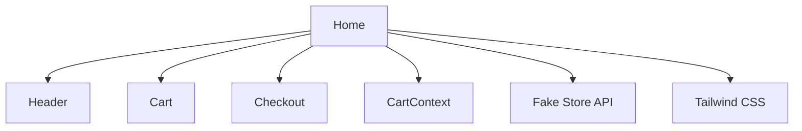

# GilStore

## 🌐 Site publicado
[Acesse a loja online](https://marciogil.github.io/GilStore/)


## ♿ Tecnologias e recursos de acessibilidade


Este projeto foi desenvolvido com foco em acessibilidade, utilizando:

- **React**: Estrutura de componentes com semântica (`header`, `main`, `button`, `form`) e navegação por teclado.
- **Tailwind CSS**: Classes utilitárias para contraste, foco visível (`focus:outline`, `focus:ring`), responsividade e acessibilidade visual.
- **Aria-labels, role e tabIndex**: Elementos interativos possuem atributos ARIA (`aria-label`, `role="button"`, `tabIndex={0}`) para leitores de tela e navegação assistida. Exemplo:

   ```tsx
   <div
      tabIndex={0}
      role="button"
      aria-label={`Ver detalhes de ${product.title}`}
      ...
   >
   ```

- **Labels em formulários**: Todos os campos de formulário possuem labels associadas para melhor compreensão e navegação por leitores de tela.

- **Foco e navegação por teclado**: Cards de produtos, modais e botões podem ser acessados e ativados via teclado, garantindo usabilidade para todos.

- **Mensagens de erro e feedbacks visuais**: Informações claras e acessíveis para todos os usuários, inclusive em estados de erro ou carregamento.

- **Testes manuais**: O site foi testado com navegação por teclado (Tab, Enter, Esc) e leitores de tela para garantir acessibilidade real.

[GitHub: MarcioGil/GilStore](https://github.com/MarcioGil/GilStore)


<p align="center">
  
</p>

# 🛒 GilStore

Loja virtual desenvolvida em React + Tailwind CSS, com catálogo dinâmico da Fake Store API, carrinho, filtros avançados, checkout e acessibilidade. O projeto é responsivo, acessível para PCDs e pronto para deploy no GitHub Pages.

## 🎯 Funcionalidades

- Catálogo de produtos dinâmico
- Filtros avançados (nome, categoria, preço, avaliação, ordenação)
- Carrinho de compras com edição
- Checkout com resumo
- Tradução de nomes e categorias para português
- Layout responsivo e acessível
- Deploy fácil no GitHub Pages

## 🏗️ Arquitetura



- **src/pages/Home.tsx**: Catálogo, filtros, lógica principal
- **src/components/Header.tsx**: Cabeçalho e nome da loja
- **src/components/Cart.tsx**: Modal do carrinho
- **src/components/Checkout.tsx**: Modal de checkout
- **src/context/CartContext.tsx**: Estado global do carrinho
- **src/services/api.ts**: Integração com Fake Store API
- **tailwind.config.js**: Configuração do Tailwind

## 🎬 Demonstração


## 🚀 Deploy

O deploy é feito via GitHub Pages. Após testar localmente, siga as instruções abaixo.


## 👨‍💻 Como Executar Localmente


   ```bash
   npm install
   npm start
   ```

Acesse [http://localhost:3000](http://localhost:3000) para visualizar.

---

## 🗄️ Mock Backend (Controle de Estoque Realista)

Para simular um backend realista com controle de estoque, utilize o **json-server** já configurado neste projeto.

### Como rodar o mock server

1. Instale as dependências (se ainda não fez):

   ```bash
   npm install
   ```
2. Inicie o mock backend em outra aba/terminal:

   ```bash
   npm run server
   ```
   Isso irá rodar o json-server em [http://localhost:3001/products](http://localhost:3001/products)

### Como funciona o controle de estoque?

- O frontend consome a API local do mock backend (`db.json`).
- Ao finalizar uma compra, o estoque de cada produto é decrementado automaticamente via API.
- Se o estoque chegar a 0, o produto ficará indisponível para novas compras.
- Você pode editar o arquivo `db.json` para resetar ou ajustar estoques manualmente.

### Testando a integração

1. Inicie o frontend normalmente (`npm start`).
2. Inicie o mock backend (`npm run server`).
3. Adicione produtos ao carrinho e finalize a compra.
4. O estoque será atualizado em tempo real no backend mock.
5. Para ver o estoque atualizado, recarregue a página ou consulte [http://localhost:3001/products](http://localhost:3001/products).

---

## 🌐 Como Fazer o Deploy no GitHub Pages

1. Configure o campo `homepage` no `package.json`:

   ```json
   "homepage": "https://MarcioGil.github.io/GilStore"
   ```
2. Instale o pacote gh-pages:

   ```bash
   npm install --save gh-pages
   ```
3. Adicione os scripts ao `package.json`:

   ```json
   "scripts": {
     "predeploy": "npm run build",
     "deploy": "gh-pages -d build"
   }
   ```
4. Execute o deploy:

   ```bash
   npm run deploy
   ```
5. O site estará disponível em: [https://MarcioGil.github.io/GilStore](https://MarcioGil.github.io/GilStore)

## 🤝 Como Contribuir

1. Faça um fork do projeto
2. Crie uma branch: `git checkout -b minha-feature`
3. Faça suas alterações
4. Envie um pull request

### Regras para Colaboradores

- Siga o padrão de código do projeto
- Escreva comentários claros
- Teste antes de enviar PR
- Respeite a licença e o código de conduta

## 📄 Licença

Este projeto está sob a licença MIT. Veja o arquivo [LICENSE](LICENSE) para mais detalhes.

## 👤 Apresentação

Olá! Eu sou **Márcio Gil**, Embaixador da turma 14 do DIO Campus Expert, Estudante do 5° período de Engenharia de Software, entusiasta da Educação, Inovação, Tecnologia e numa constante luta por Justiça Social.

- [LinkedIn](https://linkedin.com/in/márcio-gil-1b7669309)
- [Currículo](https://marciogil.github.io/curriculum-vitae/)
- [GitHub Pessoal](https://github.com/MarcioGil/MarcioGil.git)

## 📫 Contato

Fique à vontade para entrar em contato e contribuir!

---

> Projeto desenvolvido para portfólio, estudos e colaboração aberta.

## ⚡ PWA: Progressive Web App

- **Instalável**: Pode ser adicionada à tela inicial do celular ou desktop, funcionando como um app nativo.
- **Offline**: Funciona sem conexão após o primeiro acesso, graças ao service worker e cache inteligente.
- **Performance**: Carregamento rápido, otimização de bundle e recursos, experiência fluida mesmo em redes lentas.
- **Manifesto customizado**: Ícones, nome, tema e descrição próprios da GilStore.
- **Prompt de instalação**: Usuário recebe sugestão para instalar no dispositivo.

> Teste: Acesse pelo Chrome/Edge no celular ou desktop, clique em "Instalar GilStore" na barra de endereço ou menu do navegador.
